# Conversation with Discovery [](http://travis-ci.org/watson-developer-cloud/conversation-with-discovery)

This application demonstrates how you can combine the [Conversation](http://www.ibm.com/watson/developercloud/doc/conversation/index.shtml) and [Discovery](http://www.ibm.com/watson/developercloud/doc/discovery/#overview) services to allow customers, employees or the public to get answers to a wide range of questions about a product, service or other topic using plain English. First, users pose a questions to the Conversation service. If Conversation is not able to confidently answer, the app executes a call to Discovery, which to provides a list of helpful answers.

<b>Whether you deploy this app locally or on the Bluemix platform, you must have a Bluemix account and run some steps within Bluemix.</b>

&nbsp;&nbsp;&nbsp;&nbsp;&nbsp;&nbsp;&nbsp;&nbsp;&nbsp;&nbsp;&nbsp;&nbsp;&nbsp;&nbsp;&nbsp;&nbsp;&nbsp;&nbsp;&nbsp;&nbsp;&nbsp;&nbsp;&nbsp;&nbsp;&nbsp;&nbsp;&nbsp;&nbsp;&nbsp;&nbsp;&nbsp;&nbsp;&nbsp;&nbsp;&nbsp;&nbsp;[](#bluemix)     &nbsp;&nbsp;&nbsp;&nbsp;&nbsp;&nbsp;&nbsp;&nbsp;&nbsp;&nbsp;&nbsp;&nbsp;&nbsp;&nbsp;&nbsp;&nbsp;&nbsp;&nbsp;&nbsp;&nbsp;&nbsp;&nbsp;&nbsp;&nbsp;&nbsp;&nbsp;&nbsp;&nbsp;&nbsp;&nbsp;&nbsp;&nbsp;&nbsp;&nbsp;[](#local)

## How the app works

The app has a conversational interface that can answer basic questions about a fictitious cognitive car, as well as more obscure questions whose answers can be found in the car’s manual. The app uses two Watson services: Conversation and Discovery. The Conversation service powers the basic Q&A using intents, relationships and natural language, and calls the Discovery app when it encounters questions it can’t answer. Discovery searches and ranks responses from the manual to answer those questions.

The application is designed and trained for chatting with your cognitive car. The chat interface is on the left, and the JSON that the JavaScript code receives from the server is on the right. A user is able to ask two primary categories of questions.

Commands may be issued to the car to perform simple operations.  These commands are run against a small set of sample data trained with intents like "turn_on", "weather", and "capabilities".

Example commands that can be executed by the Conversation service are:

    turn on windshield wipers
    play music

In addition to conversational commands, you can also ask questions that you would expect to have answered in your car manual. For example:

    How do I check my tire pressure
    How do I turn on cruise control
    How do I improve fuel efficiency
    How do I connect my phone to bluetooth

[](https://www.youtube.com/watch?v=SasXUqBE-38)

<a name="bluemix">
# Getting Started using Bluemix
</a>


## Deploy the App

1. Select Deploy to Bluemix:   [](https://bluemix.net/devops/setup/deploy?repository=https://github.com/watson-developer-cloud/conversation-with-discovery)  

2. Log in with an existing Bluemix account or [sign up][sign_up].  
3. Name your app and then select **Create**.
  This performs multiple actions:
    - Creates the web application
    - Creates a Conversation service instance
    - Creates a Discovery service instance

  The status of the deployment is shown. This can take some time.

  When setup is complete, you are informed that you need to add environment variables.  

5. Navigate to the Conversations service in your Bluemix Dashboard and [import a workspace](#workspace). Set up your workspace then <b>return to these steps</b>.
</a>

6. Navigate to the Discovery service in your Bluemix Dashboard and [ingest the provided documents into a new Discovery collection](#ingestion). Afterwards, <b>return to these steps</b>

7. After you have set up a Conversations workspace and a Discovery collection, [add your environment variables](#env) to your Bluemix app

----

<a name="local">
# Getting Started locally
</a>


### Before you begin

-  Ensure that you have a [Bluemix account](https://console.ng.bluemix.net/registration/). While you can do part of this deployment locally, you must still use Bluemix.
-  Ensure that you have [Websphere Liberty Profile Server](https://developer.ibm.com/wasdev/downloads/liberty-profile-using-non-eclipse-environments/).

<a name="returnlocal">
### Create the services
</a>

1. In Bluemix, [create a Conversation Service instance](https://console.ng.bluemix.net/registration/?target=/catalog/services/conversation/).
  * Create the [Service Credentials](#credentials).
  * [Import a workspace](#workspace).

2. In Bluemix, [create a Discovery Service instance](https://console.ng.bluemix.net/registration/?target=/catalog/services/discovery/).
  * Create the [Service Credentials](#credentials).
  * [Ingest the documents into a new Discovery collection](#ingestion).

### Building locally

To build the application:

1. Clone the repository  
   ```
   git clone https://github.com/watson-developer-cloud/conversation-with-discovery
   ```

2. Navigate to the `conversation-with-discovery` folder

3. For Windows, type `gradlew.bat build`. Otherwise, type `gradlew build`.

4. The built WAR file (conversation-with-discovery-0.1-SNAPSHOT.war) is in the `conversation-with-discovery/build/libs/` folder.

### Running locally

1. Copy the WAR file generated above into the Liberty install directory's dropins folder. For example, `<liberty install directory>/usr/servers/<server profile>/dropins`.  
2. Navigate to the `conversation-with-discovery/src/main/resources` folder. Copy the `server.env` file.  
3. Navigate to the `<liberty install directory>/usr/servers/<server name>/` folder (where < server name > is the name of the Liberty server you wish to use). Paste the `server.env` here.  
4. In the `server.env` file, in the **"conversation"** section.  
  - Populate the "password" field.
  - Populate the "username" field.
  - Add the **WORKSPACE_ID** that you [copied earlier](#workspaceID).  
5. In the `server.env` file, in the **"discovery"** section.  
  - Populate the "password" field.
  - Populate the "username" field.
  - Add the **COLLECTION_ID** and **ENVIRONMENT_ID** that you [copied from the Discovery UI](#environmentID)  
6. Start the server using Eclipse or CLI with the command `server run <server name>` (use the name you gave your server).  
7. Liberty notifies you when the server starts and includes the port information.  
8. Open your browser of choice and go to the URL displayed in Step 6. By default, this is `http://localhost:9080/`.

---


<a name="ingestion">
## Create a collection and ingest documents in Discovery
</a>

1. Navigate to your Discovery instance in your Bluemix dashboard
2. Launch the Discovery tooling  
  

3. Create a new data collection, name it whatever you like, and select the default configuration.
  <div style="text-align:center;"></div><br>

  After you're done, there should be a new private collection in the UI  
  <div style="text-align:center;"></div>


4. Set up the custom configuration using **one** of the **two** options
  - (4a.) Upload the configuration [using the Discovery API](#configAPI)
  - (4b.) Enter the configuration settings [in the Discovery UI](#configUI)

5. On the collection tooling interface, click "Switch" on the Configuration line and select your new configuration
  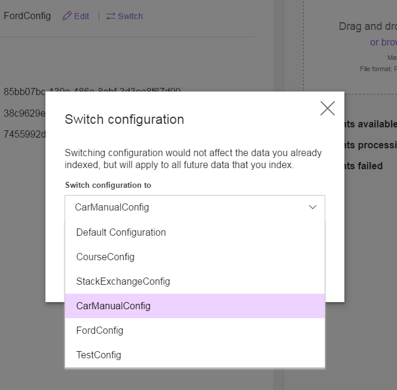

6. Download and unzip the [manualdocs.zip](src/main/resources/manualdocs.zip) in this repo to reveal a set of JSON documents

7. In the tooling interface, drag and drop (or browse and select) all of the JSON files into the "Add data to this collection" box
  - This may take a few minutes -- you will see a notification when the process is finished

<a name="configAPI">
## Set up a custom configuration with the Discovery API
</a>

1. Download the [FordConfig.json](src/main/resources/FordConfig.json) in this repo

2. Open your computer's command line interface or terminal

3. Copy and paste the curl command below into your command line

4. Replace the placeholders in the curl command with your [credentials](#credentials), path to FordConfig.json, and [environment id](#environmentID)

5. Run the command

```sh
curl -X POST -u "<username>:<password>" \
-H "Content-Type: application/json" \
–data “@<path_to_config> \
"https://gateway.watsonplatform.net/discovery/api/v1/environments/<environment_id>/configurations?version=2016-12-01"
```

<a name="configUI">
## Set up a custom configuration with the Discovery Tooling
</a>

1. The configuration for this app includes several updates from the default that are meant to help improve the results for long-tail searches. To create this configuration in the tooling, go into the collection and where the DefaultConfiguration is listed, select “Switch”
  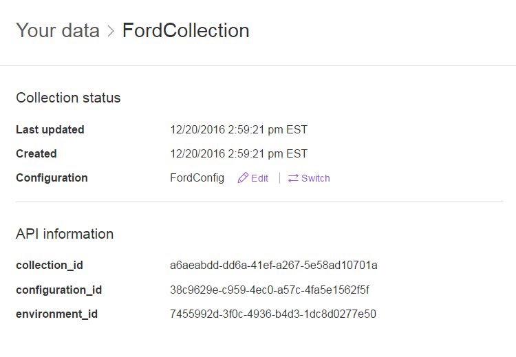

2. Then choose "Create a new configuration"
  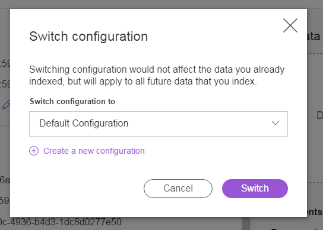

3. This brings up the configuration editor. There are three steps in a configuration, Convert, Enrich, and Normalize. The configuration editor allows you to upload a sample document to preview the results of a configuration as you make changes.
  - To use the preview, add [manual_0.json](src/main/resources/manual_0.json) into the pane on the right
  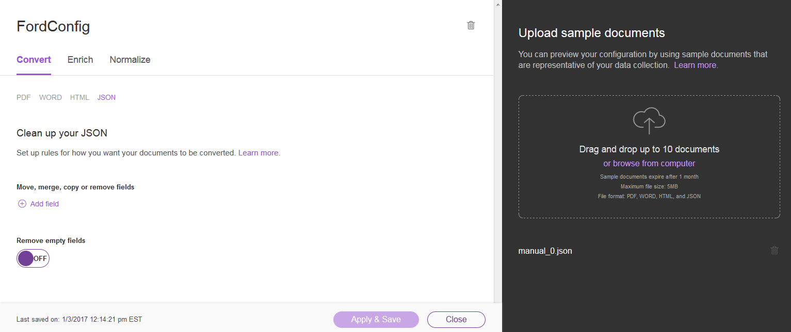

4. For the Convert step, only JSON cleanup is needed for these documents. In this case what is needed is to create two new fields that are copies of the original body and title fields so that we can use the copies in a later step to create a searchable text field.
  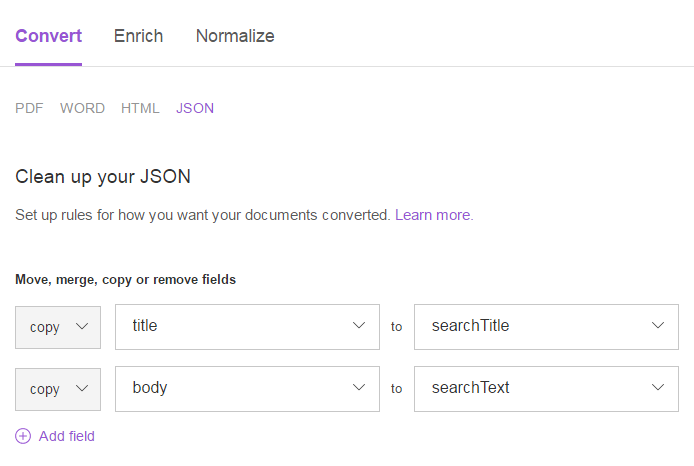
  - To create these   fields, select “Add field”, set the action to “copy” and enter title to searchTitle, and repeat for body to searchText
  - To see how the preview is affected by this step and ensure it is creating the new fields, click Apply & Save at the bottom of the page then select manual_0.json. The right side preview pane should update to display the results of the changes.
  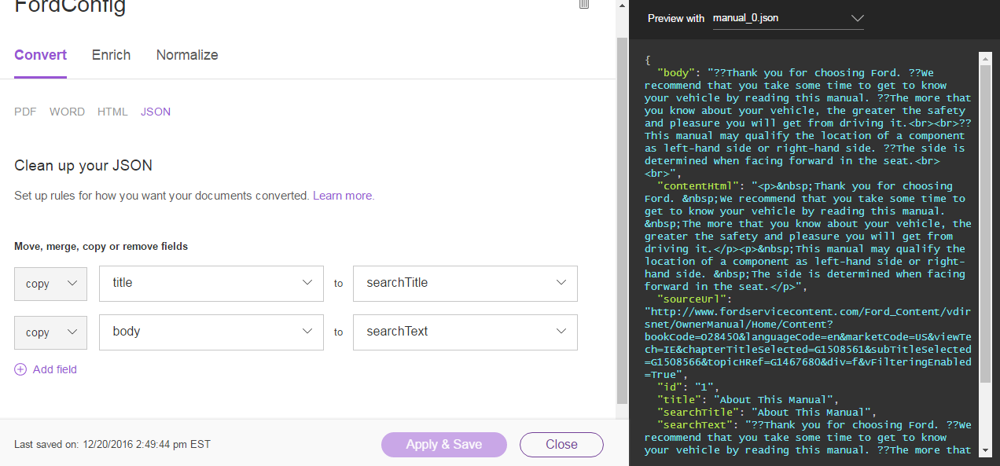

5. The next step in configuration is Enrich. Select “Enrich” from the top bar. In this we’ll set the configuration to enrich the body field of each document so we can use the enriched metadata to improve search.
  - First remove the existing “text” field that is being enriched with the default configuration by clicking the – to the right of the field.
  - Under “Add a field” enter “body” or select “body” from the dropdown
  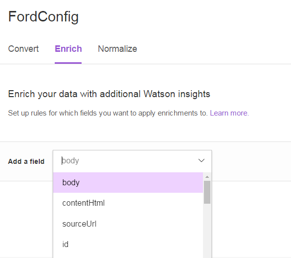
  - This will add a new field to be enriched below. You can then select the enrichments that should be applied to this field by clicking “Add enrichments”. In this case we can apply Keyword Extraction, Concept Extraction, Taxonomy Classification, and Entity Extraction. These enrichments add meta data to the documents that help improve search.
  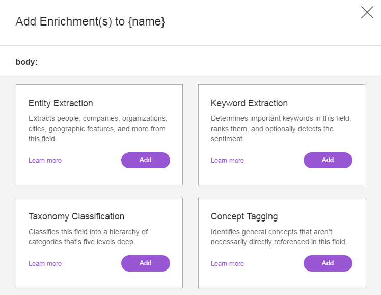
  - Once the enrichments have been selected, choose “Done” then again choose “Apply and Save” to see the results of the changes. Now there should be a body_enriched field in the preview that shows all the applied enrichments over the document
  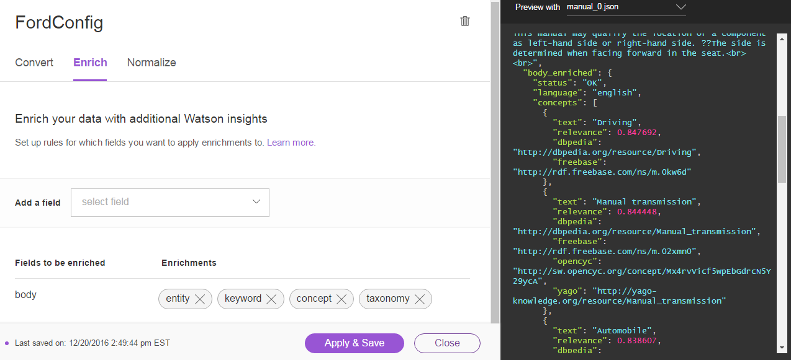

6. The final step in configuration is Normalize. This step allow you to clean up the data and fields so that you have a consistent structure for your use cases.
  - For these documents, we want to create searchable fields that can be use to improve the quality of results we get back for long tail questions
  - We will create two fields, one searchText that contains the combination of title and body, and one enrichedText field that contains the combination of extracted concepts and keywords from the body field.
  - To do this the concepts and keywords text first need to be copied into intermediate fields. To do this, click “Add field” and enter the fully qualified path to the keyword text (body_enriched.keywords.text) to enrichedText. Hint: Use the preview pane to find the paths to fields you need. Repeat this step for body_enirched.concepts.text to conceptText
  
  - Now we can merge the two intermediate fields together into the enrichedText field. Again select “Add a field”, choose the “merge” action and enter conceptText to enrichedText. This will merge the conceptText field into the enrichedText field, removing conceptText and preserving the combined enirchedText
  - Similarly we want to combine searchTitle and searchText, so click “Add a field” and merge searchTitle into searchText
  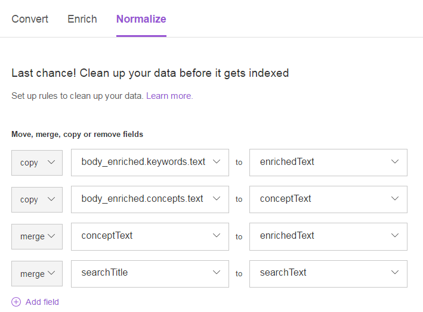
  - Finally, again select apply&save to store the updated the configuration and see the preview results.
  - In the preview pane scroll to the bottom of the new document, and you should see a searchText field containing title + body and an enrichedText field containing a list of the concepts and keywords extracted from the data.

<a name="credentials">
## Service Credentials
</a>

1. Go to the Bluemix Dashboard and select the Conversation/Discovery service instance. Once there, select the **Service Credentials** menu item.

  </img>

2. Select **New Credential**. Name your credentials then select **Add**.

3. Copy the credentials (or remember this location) for later use.

<a name="workspace">
## Import a workspace
</a>

To use the app you're creating, you need to add a workspace to your Conversation service. A workspace is a container for all the artifacts that define the behavior of your service (ie: intents, entities and chat flows). For this sample app, a workspace is provided.

For more information on workspaces, see the full  [Conversation service  documentation](http://www.ibm.com/watson/developercloud/doc/conversation/).

1. Navigate to the Bluemix dashboard and select the **Conversation** service you created.

  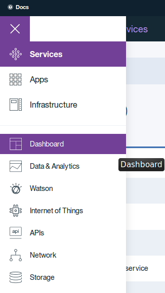

2. Click the **Launch Tool** button under the **Manage** tab. This opens a new tab in your browser, where you are prompted to login if you have not done so before. Use your Bluemix credentials.

  

3. Download the [exported JSON file](src/main/resources/workspace.json) that contains the Workspace contents.

4. Select the import icon: . Browse to (or drag and drop) the JSON file that you downloaded in Step 3. Choose to import **Everything(Intents, Entities, and Dialog)**. Then select **Import** to finish importing the workspace.

5. Refresh your browser. A new workspace tile is created within the tooling. Select the _menu_ button within the workspace tile, then select **View details**:

  

  <a name="workspaceID">
  In the Details UI, copy the 36 character UNID **ID** field. This is the **Workspace ID**.
  </a>

  

6. Return to the deploy steps that you were following:
  - For Local - [return to step 1](#returnlocal)
  - For Bluemix - [return to step 6](#returnbluemix)


<a name="env">
## Adding environment variables in Bluemix
</a>

1. In Bluemix, open the application from the Dashboard. Select **Runtime** and then **Environment Variables**.
  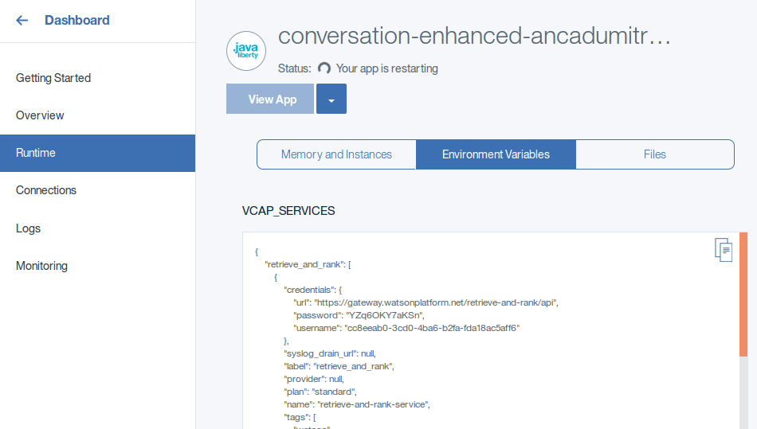
2. In the **User Defined** section, add the following Conversations environment variables:
  - **CONVERSATION_PASSWORD**: Use your Conversations [service credentials](#credentials)
  - **CONVERSATION_USERNAME**: Use your Conversations service credentials
  - **WORKSPACE_ID**: Add the Workspace ID you [copied earlier](#workspaceID).
3. Then add the following four Discovery environment variables to this section:
  - **DISCOVERY_PASSWORD**: Use your Discovery [service credentials](#credentials)
  - **DISCOVERY_USERNAME**: Use your Discovery service credentials
  - **DISCOVERY_COLLECTION_ID**: Find your collection ID in the Discovery collection you created
  - **DISCOVERY_ENVIRONMENT_ID**: Find your environment ID in the Discovery collection you created
  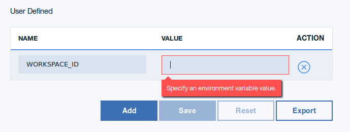
4. Select **SAVE**.
5. Restart your application.

---

## Troubleshooting in Bluemix

1. Log in to Bluemix, you'll be taken to the dashboard.
1. Navigate to the the application you previously created.
1. Select **Logs**.  
  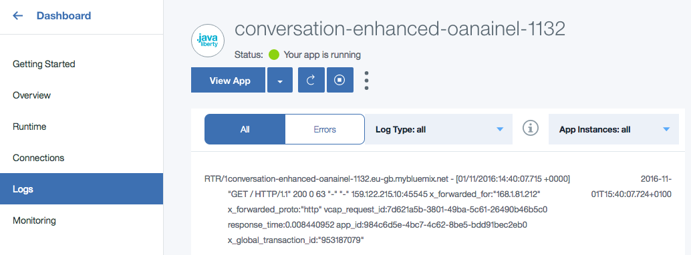

## License

  This sample code is licensed under Apache 2.0.
  Full license text is available in [LICENSE](LICENSE).

## Contributing

  See [CONTRIBUTING](CONTRIBUTING.md).

## Open Source @ IBM

  Find more open source projects on the
  [IBM Github Page](http://ibm.github.io/).


[cloud_foundry]: https://github.com/cloudfoundry/cli
[getting_started]: https://www.ibm.com/watson/developercloud/doc/getting_started/
[conversation]: http://www.ibm.com/watson/developercloud/conversation.html
[discovery]: http://www.ibm.com/watson/developercloud/discovery.html

[docs]: http://www.ibm.com/watson/developercloud/conversation/
[sign_up]: https://console.ng.bluemix.net/registration/
